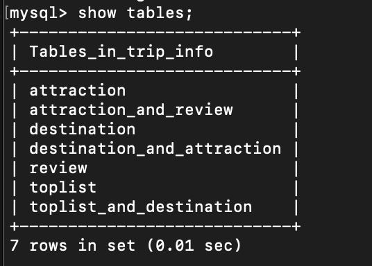
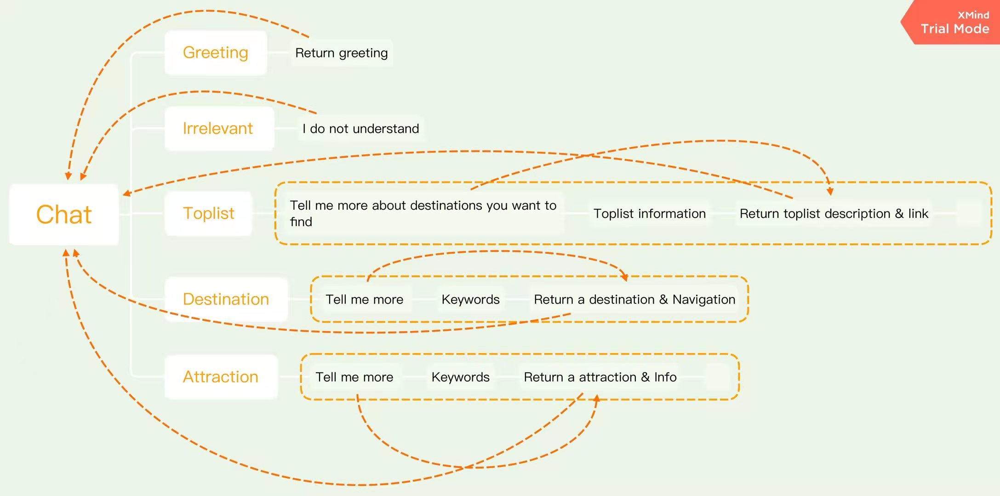

# Development doc for chatbot

## Project overview
```bash
.
├── chatbot_config.py           # configuration file for our chatbot
├── database                    # mysql configuration files 
│   ├── docker-compose.yaml     # used to run a mysql container on my computer for developing
│   └── mysql_data              # equals to the files in /var/lib/mysql
├── document                    # document of this project
├── lib                         # chatbot library
│   ├── abstract_status.py      # an abstract class (or Interface in Java) used for objected-oriented programming
│   ├── intent_classificion.py  # functions used for users' intent classification
│   ├── recommendation.py       # functions used for recommending specific content based on users' input
│   └── status.py               # a child class of the AbstractStatus
├── main.py                     # chatbot entrance 
├── meta                        # some useful objects saved using Pickle
│   ├── destination_df.pk
│   ├── intent_classification_svc.pk
│   ├── review_df.pk
│   └── toplist_df.pk
├── spider                      # root directory for scrapy
│   ├── trip_com                # scripts used for grabing content from trip.com 
│   │   ├── scrapy.cfg
│   │   └── trip_com
├── templates                   # html pages, css, javascript fils used in the frontend webpage.
│   ├── Stats.js
│   ├── TweenMax.min.js
│   ├── chatbox.html
│   ├── css
│   ├── css_globe_PerspectiveTransform.js
│   ├── dat.gui.min.js
│   ├── fonts
│   ├── images
│   ├── index.html
│   ├── index.html.bak
│   ├── js
│   ├── modernizr.min.js
│   ├── script.js
│   ├── style.css
│   └── test.html
└── utils.py                    # some useful functions 
```

## Step 1 of our project --- grabbing data
> library: `scrapy`  
> link: `https://scrapy.org/`  
> code examples:  

```python 
# this function was used to grab the content from 
# https://www.trip.com/travel-guide/inspiration-list/
def inspiration_parser(self, response, **kwargs):

    toplists = response.css('[class="jsx-3344324880 toplist-content"]')
    toplist_items = list()
    for cur_toplist in toplists:
        name = cur_toplist.css('[class="jsx-3344324880 title"]')\
            .css('a.jsx-3344324880::text').get()
        link = cur_toplist.css('[class="jsx-3344324880 more-icon"]')\
            .css("a.jsx-3344324880::attr(href)").get()
        toplist_info = {"name": name, "link": link}
        toplist_items.append(toplist_info)
        yield scrapy.Request(link, self.toplist_parser, meta={"inspiration": name})

    yield {"inspirations": toplist_items, "type": "inspirations"}


# this function was used to grab the content from webpages like
# https://www.trip.com/travel-guide/toplist-569/
def toplist_parser(self, response, **kwargs):

    res = dict()
    res["type"] = "toplists"
    res["inspiration"] = response.meta["inspiration"]
    res["destinations"] = list()
    destination_list = response.css('[class="jsx-946890623 item"]')

    for cur_destination in destination_list:

        cur_destination_info = dict()

        cur_destination_name = cur_destination.css('[class="jsx-946890623 content-title"]')\
            .css("a.jsx-946890623::attr(title)").get()

        cur_destination_link = cur_destination.css('[class="jsx-946890623 content-title"]') \
            .css("a.jsx-946890623::attr(href)").get()

        cur_destination_description = cur_destination.css('[class="jsx-946890623 content-p"]::text').getall()

        cur_destination_info["name"] = cur_destination_name
        cur_destination_info["link"] = cur_destination_link
        cur_destination_info["description"] = cur_destination_description

        res["destinations"].append(cur_destination_info)

        yield scrapy.Request(cur_destination_info["link"], callback=self.destination_parser,
                                meta={"toplist": res["inspiration"]})

    yield res
```

> Collected content looks like this:  
```json 
{
  "inspirations": {
    "inspirations": [
      {
        "name": "Best Asia-Pacific Travel Destinations",
        "link": "https://www.trip.com/travel-guide/toplist-569/"
      },
      {
        "name": "Celebrate Chinese New Year in Asia",
        "link": "https://www.trip.com/travel-guide/toplist-162/"
      },
      {
        "name": "The World's Most Beautiful Self-Driving Tours",
        "link": "https://www.trip.com/travel-guide/toplist-580/"
      }
    ],
    "type": "inspirations"
  },
  "toplists": {
    "type": "toplists",
    "inspiration": "Best Asia-Pacific Travel Destinations",
    "destinations": [
      {
        "name": "Margaret River, Australia",
        "link": "https://www.trip.com/travel-guide/margaret-river-1606/",
        "description": [
          "Don't miss the beautiful sea cliffs at Meelup Beach",
          " ",
          " ",
          "Top wineries, craft breweries, and the best food"
        ]
      },
      {
        "name": "Takamatsu, Japan",
        "link": "https://www.trip.com/travel-guide/takamatsu-56911/",
        "description": [
          "Tour the 88 beautiful temples on Shikoku Island",
          " ",
          " ",
          "Attend the Setouchi International Arts Festival"
        ]
      }
    ]
  },
  "destination": {
    "type": "destination",
    "toplist": "Best Asia-Pacific Travel Destinations",
    "name": "Nadi",
    "loc_tags": "Trip, Travel Guides, Oceania, Fiji, Western Division, Nadi",
    "navigation": {
      "Attractions": "https://www.trip.com/travel-guide/nadi-1339/tourist-attractions/",
      "Hotels": "https://www.trip.com/hotels/list?city=791",
      "Restaurants": "https://www.trip.com/travel-guide/nadi-1339/restaurants/",
      "Tours/Tickets": "https://www.trip.comhttps://us.trip.com/things-to-do/list?searchtype=1&searchkey=791&language=EN&locale=en_us",
      "Trip Moments": "https://www.trip.com/travel-guide/nadi-1339/image/"
    }
  },
  "attractions": {
    "type": "attractions",
    "attractions": [
      {
        "name": "The Palace Museum",
        "link": "https://www.trip.com/travel-guide/beijing/the-palace-museum-75595/"
      },
      {
        "name": "Badaling Great Wall",
        "link": "https://www.trip.com/travel-guide/beijing/badaling-great-wall-75596/"
      }
    ],
    "destination": "Beijing"
  },
  "attraction": {
    "type": "attraction",
    "destination": "Hiroshima",
    "loc_tags": "Trip, Travel Guides, Asia, Japan, Hiroshima, Hiroshima, Mount Misen",
    "name": "Mount Misen",
    "open_status": "Open 24 hours",
    "recommended_sightseeing_time": "2-3 hours",
    "phone": "+81-829-309141",
    "address": "Miyajimacho, Hatsukaichi, Hiroshima Prefecture",
    "reviews": [
      "Mount Misen is the sacred mountain on Itsukushima in Hatsukaichi, Hiroshima, Japan, and is the highest mountain on the island at 535 m; it is situated within the World Heritage area of Itsukushima Shrine. The sea around the island and all of the island are within Setonaikai National Park.\u00a0",
      "Miyama is behind Itsukushima Shrine and is a world natural heritage. Walking from the shrine to Mishan, you will pass a delicious commercial street and a forest road with artistic conception. There are a lot of people lining up to take the cable car, but the signs on both sides of the line are fun and not boring. After arriving at the top of the mountain, the viewing platform is very beautiful, allowing visitors to immediately see the beauty of Mishan. After walking through a mountain path that feels ordinary, I am really serious about climbing the mountain. I will pass a few shrines first. Zhu Yuyin is also quite distinctive. At the end, the scenery on the top of the mountain is vast and the mountains and green waters are quiet. It takes a day to visit Mishan and Itsukushima Shrine. The beauty of the two places is completely different, and I feel a kind of peace of mind.",
      "Mount Mishan is 535m above sea level and is the main peak of Miyajima. Because it has been admired as a sacred mountain since ancient times, the natural environment is well protected, and the original ecological environment is preserved. Many rare animals and plants grow in the virgin forest on the mountain, which is listed in the world as Mishan virgin forest and Itsukushima Shrine. Heritage list.",
      "Miyama, Japan\u2019s three scenic spots, took a car to the Shishi Rock Observation Deck and walked for 30 minutes to the top of the mountain. It happened that there were too many people on that day. It was already 4 o\u2019clock in the afternoon, and the queue was about 1 hour. The queue was exhausting. After 5 minutes, I came down. I'm afraid that the car will take a long time to line up. Although the scenery is good, there are mountains and waters, it takes a lot of time to line up, and the price is not high.",
      "This mountain is not very high, but standing on the top of the mountain, you can overlook the entire mountain, and the scenery on the sea has a small view of the mountains. Looking at the clouds in the sky, and the big ships on the sea, There is a kind of quiet time."
    ]
  }
}
```

**Then I stored the grabbed content in mysql. Tables are like this:**  




## Step 2 of our project --- chatbot logic
**The pipline of our chatbot can be represented by the following graph:**


**To implement the logic in the figure, we need to define a abstract class and several child classes to represent `Status`**  
**Here is the code of `AbstractStatus`**  
```python 
class AbstractStatus(metaclass=ABCMeta):
    @abstractmethod
    def __init__(self):
        pass

    @abstractmethod
    def make_response(self):
        pass
```

**Here is the code of the `StartStatus` or `InitialStatus`**  
```python
class StartStatus(AbstractStatus):
    def __init__(self):
        self.type = "StartStatus"
        self.end_topic = False

    def make_response(self):
        return ""
```

**Here is the transformation logic:**  
```python
def next_status(cur_status, user_input):
    try:
        new_status = None
        if cur_status.type == "StartStatus":
            intent_idx, intent_name = intent_classificion.inference(intent_classification_svc, user_input, w2v_model)
            if intent_name == "greeting":
                new_status = GreetingStatus()
                return new_status
            if intent_name == "toplist":
                new_status = ToplistStatus1()
                return new_status
            if intent_name == "destination":
                new_status = DestinationStatus1()
                return new_status
            if intent_name == "attraction":
                new_status = AttractionStatus1()
                return new_status
            if intent_name == "irrelevant":
                new_status = IrrelevantStatus()
                return new_status
        if cur_status.type == "ToplistStatus1":
            new_status = ToplistStatus2(toplist_df=toplist_df,
                                        sentence=user_input,
                                        w2v_model=w2v_model,
                                        db_connector=db_connector)
            return new_status
        if cur_status.type == "DestinationStatus1":
            new_status = DestinationStatus2(destination_df=destination_df,
                                            sentence=user_input,
                                            w2v_model=w2v_model,
                                            db_connector=db_connector)
            return new_status
        if cur_status.type == "AttractionStatus1":
            new_status = AttractionStatus2(review_df=review_df,
                                           sentence=user_input,
                                           w2v_model=w2v_model,
                                           db_connector=db_connector)
            return new_status
        return ErrorStatus() if new_status is None else new_status
    except:
        new_status = ErrorStatus()
        return new_status
```

**And here is the transformation process.**
```python 
@app.route("/get_response", methods=["POST"])
def get_bot_response():
    chat_history = utils.convert_request_form_to_list(request.form)

    global cur_status
    cur_status = next_status(cur_status, chat_history[-1]["content"])
    response = cur_status.make_response()

    if cur_status.end_topic:
        cur_status = StartStatus()

    return jsonify(response)
```


## Step 3 of our project --- intent classification
**When users input a text, we need to figure out what they want to do. So the first step of our chatbot is to train a classifier.**  
**Based on our application area (Traveling), we can group users' intents into the following classes.**
```bash 
greeting      # She want to say hi to you
toplist       # She wants you to suggest her a list of places to go
destination   # She wants you to recommend her a city or a island to go
attraction    # She wants you to tell her an attraction to go
irrelevant    # She said something not in our scope
```

**To train such a classifier, we need data. But this kind of data is hard to collect.**  
**When data is insufficient, we have two ways to train a classifier:**  
> 1. Few shot learning  
> 2. Data augmentation --- We used this method.

**Data augmentation is commonly used in computer vision, especially image classification. We can use the insight from that. Here is a example text augmentation function.**
```python 
def sentence_augmentation(sentence, w2v_model, topn=30, threshold=0.9, expected_count=200):
    ret_list = list()
    for w in nltk.word_tokenize(sentence):
        if not w in w2v_model:
            continue
        similar_words = [cur_pair[0] for cur_pair in w2v_model.similar_by_word(w) if cur_pair[1] > threshold]
        if similar_words:
            ret_list.extend([sentence.replace(w, cur_similar_word) for cur_similar_word in similar_words])
    return ret_list

"""
for example:
sentence_augmentation("I want to find a beautiful place to go", w2v_model)

result: (all this sentences share the same label with the original sentence)
['we want to find a beautiful place to go',
 'you want to find a beautiful place to go',
 'I wanted to find a beautiful place to go',
 'I need to find a beautiful place to go',
 'I prefer to find a beautiful place to go',
 'I wanna to find a beautiful place to go',
 'I want to discover a beautiful place to go',
 'I want to locate a beautiful place to go',
 'I want to uncover a beautiful place to go',
 'I want to find a gorgeous place to go',
 'I want to find a lovely place to go',
 'I want to find a stunningly_beautiful place to go',
 'I want to find a breathtakingly_beautiful place to go',
 'I want to find a wonderful place to go',
 'I want to find a fabulous place to go',
 'I want to find a loveliest place to go',
 'I want to find a beatiful place to go',
 'I want to find a magnificent place to go',
 'I want to find a beautiful palce to go',
 'I want to find a beautiful places to go',
 'I want to find a beautiful spot to go',
 'I want to find a beautiful place to sit',
 'I want to find a beautiful place to stay']
 """
```
**Even though there are some grammar errors, our classifier does not care. So basically, we can use the augmented data.**

**Data's problem is done. Now we can use the dataset to train a SVM.**


## Step 4 of our project --- recommendation
**In this project, we use cosine similarity as reference when recommend content to users.**

**Firstly, we use the following function (word2vec method) to generate features for each toplist, destination, attraction**
```python 
def generate_w2v_feature(words, w2v_model, feature_size=300):
    return np.mean([w2v_model[w] for w in nltk.word_tokenize(words) if w in w2v_model]
                   or [np.zeros(feature_size)], axis=0)
```

**After we get the feature of our dataset (toplists, destinations, attractions), we generate the feature of users' input by the above function. Then we calculate the cosine similarities and return the id of the most similar one.**
```python 
def find_most_similar_toplist(toplist_df, sentence, w2v_model, threshold=0.3):
    x = generate_w2v_feature(sentence, w2v_model).reshape(1, -1)
    similarity_with_toplist = np.array(
        [cosine_similarity(x, cur_toplist_feature.reshape(1, -1))
         for cur_toplist_feature in toplist_df["feature"]]
    ).reshape((-1, ))
    idx = similarity_with_toplist.argmax()
    return toplist_df["id"][idx] if similarity_with_toplist[idx] > threshold else -1
```

**Then, we can find the record in our dataset by id and recommend it to our users.**
```python 
def recommend_toplist_by_sentence(toplist_df, sentence, w2v_model, db_connector):
    toplist_id = find_most_similar_toplist(toplist_df, sentence, w2v_model)
    if toplist_id == -1:
        return None
    mycursor = db_connector.cursor(buffered=True)
    mycursor.execute("SELECT * FROM toplist WHERE id=%d" % toplist_id)
    toplist = mycursor.fetchone()

    return {"id": toplist[0], "name": toplist[1], "link": toplist[2]}
```

## Step 4 of our project --- deployment using docker container and docker-compose 

```yaml 
# docker-compose.yaml
version: '3.1'

services:

  db:
    image: mysql:latest
    command: --default-authentication-plugin=mysql_native_password
    restart: always
    environment:
      MYSQL_ROOT_PASSWORD: chatbot5125
      MYSQL_USER: chaoyi
      MYSQL_PASSWORD: cliu241
    volumes:
      - ./database/mysql_data:/var/lib/mysql
    ports:
      - 3306:3306

  chatbot:
    image: chatbot_v5
    environment:
      DATABASE_HOST: db
    ports:
      - 5005:5000


```